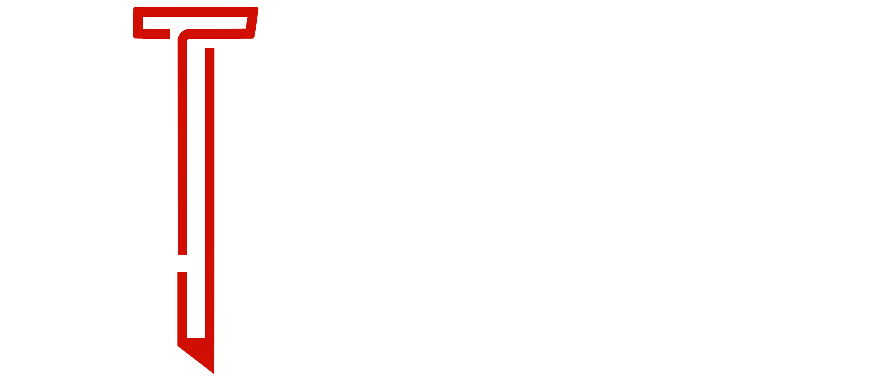

  

# Studios Riba

> **Studios Riba** es una desarrolladora independiente de videojuegos y productora de cortometrajes de autor. Descubre experiencias interactivas como Kurt Cobalto y Makka Pakka 2, o sumérgete en thrillers cinematográficos como El Caso Darkface. Cine y videojuegos unidos por una misma visión artística y cuidada estética audiovisual. Elige tu universo.

  <a href="https://studiosriba.github.io](https://studiosriba.netlify.app/">🌐 Visita nuestro sitio web</a> |
  <a href="https://studiosriba.itch.io/">🎮 Juegos en itch.io</a> |
  <a href="https://www.youtube.com/@studiosriba">📺 YouTube</a> |
  <a href="https://x.com/_studiosriba">🐦 Twitter/X</a>

---

## 🗂 Estructura del Proyecto

Este repositorio contiene el código fuente de nuestra plataforma principal (Portfolio/Hub), diseñada a medida sin depender de frameworks pesados, con animaciones puras en CSS y Canvas interactivo.

- **`index.html`** - Gateway principal de elección de universo.
- **`studiosriba.html`** - Sección de desarrollo de videojuegos (Catálogo e interactividad en canvas).
- **`studiosribaproductions.html`** - Productora de cortometrajes (Showcase de películas y filosofía).
- **`style.css`** - Sistema de diseño unificado, variables, tokens y animaciones de revelado.
- **`script.js`** - Lógica de transiciones de página, cursor personalizado, partículas y carga de bases de datos.
- **`database/`** - Datos locales (`.json`) para la inyección dinámica de juegos y películas.
- **`media/`** - Activos visuales y elementos de branding de la compañía.

 

  

## ⚙️ Tecnologías

- **Vanilla JavaScript (ES6+)**
- **HTML5 & CSS3** (Variables nativas, flexbox, grid, animaciones 3D fluidas)
- **Intersection Observer API** (Para activaciones asíncronas de scroll)
- **Canvas API** (Grid interactivo reactivo al ratón)

## 💽 Database / Gestión de contenido

El contenido es 100% dinámico y escalable. Para añadir o modificar juegos y cortos sin editar el HTML, simplemente actualiza las entradas en:
- `database/games.json`
- `database/movies.json`

El motor de renderizado del cliente se encarga automáticamente de parsear los datos e inyectar el marcado y sus animaciones en el DOM.

---

  <i>Diseñado y construido con pasión por el equipo creativo de <b>Studios Riba</b>.</i>

